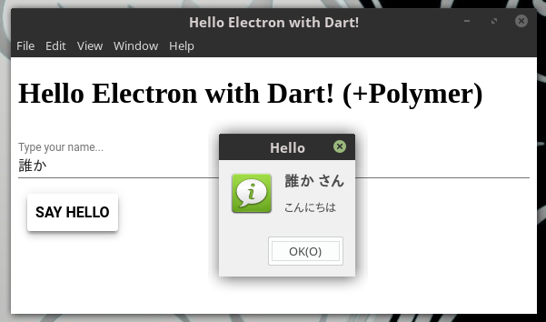

Write the main process with Dart (Electron example)
====================================

レンダラ側をDartで書いたElectronの[サンプルコード](https://github.com/takutaro/electron-with-dart-sample)に続き、メインプロセスもDartで書いてみました。<br>

## Description

Electronのメインプロセス側をDartで書く場合、JSとの相互運用を考える必要があります。<br>

今回、メインプロセス側のDartコードのJSへのトランスパイルはDDC(Dart Dev Compiler)を使ってみます。<br>
ｎｏｄｅjs向けのリーダブルなJSコードを吐いてくれます。

## Demo

[本家Electronのチュートリアル](https://electron.atom.io/docs/tutorial/quick-start/)
をベースに、以下の様な簡単なアプリを作成します。

* Polymerのpaper-inputを使用した入力欄にテキストを打ち、下のボタンを押すと、ダイアログが表示されます。
* ダイアログ表示はメインプロセスとのプロセス間通信によるものです。remoteモジュールを使用しています。
* (ダイアログ表示の際にレンダラープロセスがブロックする為か、paper-buttonのアニメーションが途中で止まってしまいますね・・)

 

## Requirement

[前回](https://github.com/takutaro/electron-with-dart-sample)に加え、DDCの環境を構築する必要があります。

* Dartの開発環境(前回と同様)
* node.js(6系以上)(前回と同様)
* DDCの環境( [dev_compiler/USAGE.md](https://github.com/dart-lang/sdk/blob/master/pkg/dev_compiler/USAGE.md) 参照)

なお、本サンプルコードはLinuxで実行を確認していますが、他のOSについては適宜読み替え願います。

## Installation

ローカルにcloneします。

```bash
$ git clone https://github.com/takutaro/electron-with-dart-sample2.git
```

依存パッケージを取得します。

```bash
$ cd electron-with-dart-sample2
$ pub get

$ cd web
$ npm install
```

なお、web/node_modules配下にはclone時点で dart_sdk.js が含まれていますが、
これはDDCが生成したJSから呼ばれるランタイム的なものです。<br>
[dev_compiler/lib/js/common/](https://github.com/dart-lang/sdk/tree/master/pkg/dev_compiler/lib/js/common) から拝借しています ;;

## Usage

まず、cloneしたディレクトリ（pubspec.yamlのある場所。上記ではelectron-with-dart-sample2）で、
pub serve起動します。

```bash
$ cd electron-with-dart-sample2
$ pub serve
Loading source assets...
Loading polymer transformers...
Serving electron_with_dart web on http://localhost:8080
Build completed successfully
```

次別ターミナルで、Electronアプリを「pubserve」指定で起動します。<br>
と、その前にmain.dartをDDCでJSにトランスパイルしておきます（main.dart.js等のファイルが生成されます）。

```bash
$ cd electron-with-dart-sample2
$ cd web
$ dart $DDC_PATH/bin/dartdevc.dart --modules node -o main.dart.js main.dart
```

```bash
$ npm run-script pubserve

> electron-with-dart@1.0.0 pubserve /home/taku/workspace/electron-with-dart-sample/web
> electron . --pubserve
```

## Anything Else

DDCを使用するにあたり、コンパイルのシンプル化やdart_sdk.jsの配布方法で悩みました。<br>
結局日和りましたが。

## Author

takutaro

## License

特に無いです。
